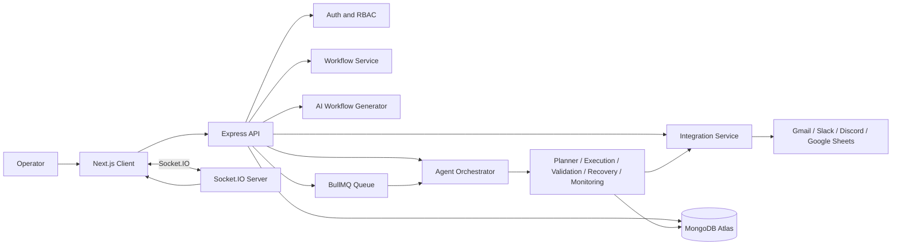
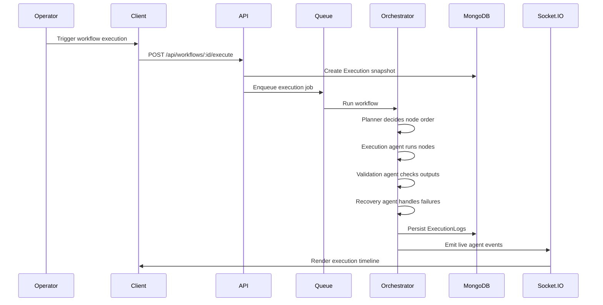
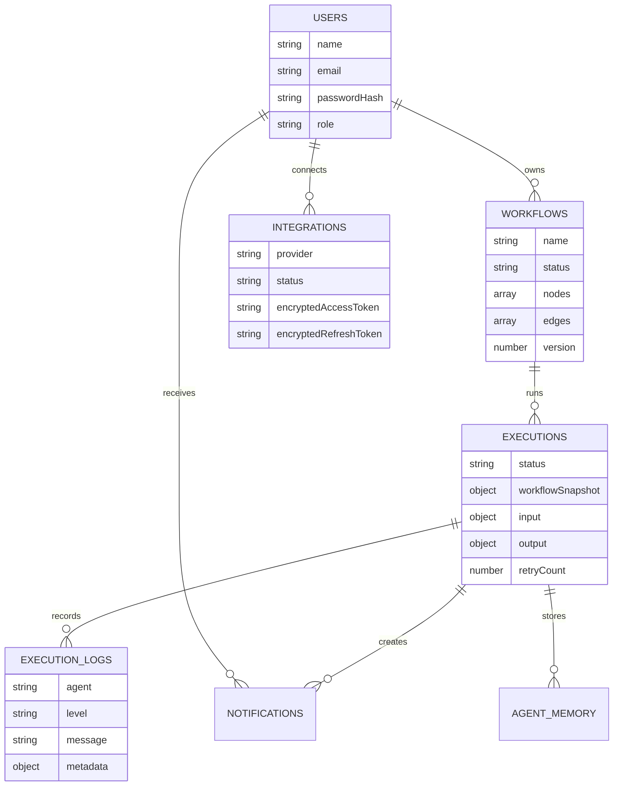

# Agentflow_AI

Agentflow_AI is an agentic AI automation platform for turning natural-language automation requests into executable visual workflows. Operators can describe a process in plain English, generate a workflow graph, edit it on a React Flow canvas, execute it through a multi-agent backend, stream live execution events, and keep a MongoDB-backed audit trail of every run.

The platform is designed as an operations console in the spirit of workflow automation tools like n8n or Zapier, with an explicit AI agent orchestration layer on top.

## Highlights

- Prompt-to-workflow generation with OpenRouter, Google Gemini, and deterministic fallback generation.
- Visual workflow editing with React Flow nodes, edges, node configuration, and execution controls.
- Multi-agent execution chain: planner, execution, validation, recovery, and monitoring agents.
- Real-time execution timeline through Socket.IO.
- JWT authentication with role separation for `admin` and `operator`.
- MongoDB persistence for users, workflows, executions, logs, integrations, notifications, and agent memory.
- OAuth-ready integrations for Gmail, Slack, Discord, and Google Sheets.
- BullMQ/Redis background execution with in-memory fallback when Redis is not configured.
- Encrypted integration credentials at rest.

## Architecture



## Execution Flow



## Tech Stack

| Layer | Technology |
| --- | --- |
| Frontend | Next.js Pages Router, React 19, Tailwind CSS, Zustand, Axios |
| Workflow UI | React Flow via `@xyflow/react`, lucide-react icons |
| Realtime | Socket.IO client and server |
| Backend | Node.js, Express, Mongoose, JWT, bcryptjs |
| Database | MongoDB / MongoDB Atlas |
| Queue | BullMQ with Redis via ioredis, with in-memory fallback |
| AI | OpenRouter API, Google Generative AI SDK, LangChain/LangGraph |
| Security | helmet, CORS, express-rate-limit, express-validator, encrypted credentials |

## Repository Structure

```text
.
+-- client/                 # Next.js frontend
|   +-- src/components/     # AppShell, dashboard, workflow, integration UI
|   +-- src/hooks/          # Client hooks
|   +-- src/pages/          # Pages Router routes
+-- server/                 # Express backend
|   +-- src/agents/         # Planner, execution, validation, recovery, monitoring
|   +-- src/config/         # Env, MongoDB, Socket.IO
|   +-- src/controllers/    # HTTP response shaping
|   +-- src/integrations/   # Gmail, Slack, Discord, Google Sheets adapters
|   +-- src/middleware/     # Auth, validation, rate limiting, errors
|   +-- src/models/         # Mongoose schemas
|   +-- src/queues/         # BullMQ and fallback queue handling
|   +-- src/routes/         # API route modules
|   +-- src/services/       # Business logic
|   +-- src/validators/     # express-validator rules
+-- spec.md                 # Full product and architecture specification
+-- README.md               # Project documentation
```

## Core Modules

### Authentication

Agentflow_AI supports user registration, login, JWT sessions, protected routes, role-based access control, and a `/api/auth/me` endpoint. Passwords are hashed with bcrypt before storage.

### Workflow Builder

Users can generate workflows from prompts or create them manually. Workflows store nodes, edges, trigger configuration, tags, owner, status, and version metadata. The frontend renders and edits workflows with React Flow.

### AI Workflow Generation

Prompt generation follows this provider order:

1. OpenRouter when `OPENROUTER_API_KEY` is configured.
2. Google Gemini when `GEMINI_API_KEY` is configured.
3. Deterministic rule-based builder when no AI key is configured.

The fallback builder can still create runnable workflow graphs for common prompts such as email sending, Slack or Discord notification, invoice routing, and Google Sheets appends.

### Agentic Orchestration

Each workflow execution moves through a fixed agent chain:

| Agent | Responsibility |
| --- | --- |
| Planner | Orders nodes and emits a confidence score |
| Execution | Runs workflow nodes against integrations or AI providers |
| Validation | Checks required output fields |
| Recovery | Classifies failures and decides retry or escalation |
| Monitoring | Emits timeline events and execution observability data |

Failure classes include `MISSING_FIELDS`, `API_FAILURE`, `AUTH_EXPIRED`, `RATE_LIMIT`, and `TRANSIENT`.

### Integrations

The integration layer is built around provider adapters for:

- Gmail: send and read mail
- Slack: post messages and subscribe to events
- Discord: post bot messages
- Google Sheets: append rows and read ranges

OAuth tokens are intended to be encrypted at rest using `CREDENTIAL_ENCRYPTION_KEY`.

### Execution Timeline

Executions are persisted as immutable workflow snapshots. Each agent event is written as an execution log and streamed to subscribed clients over Socket.IO so the UI can render a live timeline.

## Data Model



## API Overview

### Health and Auth

| Method | Endpoint | Description |
| --- | --- | --- |
| GET | `/api/health` | Service heartbeat |
| POST | `/api/auth/register` | Create a user account |
| POST | `/api/auth/login` | Authenticate and issue JWT |
| GET | `/api/auth/me` | Return authenticated profile |

### Workflows

| Method | Endpoint | Description |
| --- | --- | --- |
| GET | `/api/workflows/dashboard` | Dashboard metrics |
| GET | `/api/workflows` | List workflows |
| POST | `/api/workflows` | Create workflow |
| POST | `/api/workflows/generate` | Generate workflow from prompt |
| GET | `/api/workflows/:id` | Get workflow |
| PUT | `/api/workflows/:id` | Update workflow |
| POST | `/api/workflows/:id/duplicate` | Duplicate workflow |
| POST | `/api/workflows/:id/execute` | Execute workflow |
| DELETE | `/api/workflows/:id` | Delete workflow |

### Executions

| Method | Endpoint | Description |
| --- | --- | --- |
| GET | `/api/executions` | List executions |
| GET | `/api/executions/:id` | Get execution detail |
| GET | `/api/executions/:id/timeline` | Get execution logs |
| POST | `/api/executions/:id/pause` | Pause execution |
| POST | `/api/executions/:id/resume` | Resume execution |
| POST | `/api/executions/:id/cancel` | Cancel execution |

### Integrations and Notifications

| Method | Endpoint | Description |
| --- | --- | --- |
| GET | `/api/integrations` | List integrations |
| GET | `/api/integrations/status` | Provider health and connection status |
| GET | `/api/integrations/oauth/:provider/start` | Start OAuth flow |
| GET | `/api/integrations/oauth/:provider/callback` | Handle OAuth callback |
| GET | `/api/integrations/oauth/error` | OAuth error response |
| POST | `/api/integrations` | Create or update integration config |
| GET | `/api/notifications` | List notifications |

## Frontend Pages

| Route | Purpose |
| --- | --- |
| `/` | Landing and authentication-aware redirect |
| `/login` | Login flow |
| `/register` | Registration flow |
| `/dashboard` | Operator console and metrics |
| `/workflows/builder` | AI prompt-to-workflow builder |
| `/workflows/[id]` | Full workflow editor |
| `/executions` | Execution history and status |
| `/integrations` | Provider connection management |
| `/settings` | Profile, security, preferences, and logout |

## Getting Started

### Prerequisites

- Node.js 20 or newer recommended
- npm
- MongoDB Atlas cluster or local MongoDB instance
- Redis is optional; when omitted, the server can use an in-memory queue fallback

### Install Dependencies

```bash
npm install
npm install --prefix server
npm install --prefix client
```

### Environment Variables

Create `server/.env`:

```env
PORT=5000
CLIENT_URL=http://localhost:3000
MONGO_URI=mongodb+srv://<username>:<password>@<cluster-url>/<database>?retryWrites=true&w=majority
MONGO_DNS_SERVERS=
JWT_SECRET=replace-with-a-long-random-secret
CREDENTIAL_ENCRYPTION_KEY=replace-with-a-32-byte-secret
REDIS_URL=
OPENROUTER_API_KEY=
GEMINI_API_KEY=
```

Create `client/.env.local` or use `client/.env.example` as a base:

```env
NEXT_PUBLIC_API_URL=http://localhost:5000/api
NEXT_PUBLIC_SOCKET_URL=http://localhost:5000
```

`MONGO_DNS_SERVERS` is optional. It can be useful on machines where Node resolves `mongodb+srv` through a broken local DNS proxy. Example:

```env
MONGO_DNS_SERVERS=1.1.1.1,8.8.8.8
```

### Run Locally

Run both apps from the repository root:

```bash
npm run dev
```

Or run them separately:

```bash
npm run dev --prefix server
npm run dev --prefix client
```

Default URLs:

- Client: `http://localhost:3000`
- Server: `http://localhost:5000`
- API health: `http://localhost:5000/api/health`

### Build Frontend

```bash
npm run build --prefix client
```

## MongoDB Atlas Notes

For Atlas connections:

1. Add your current IP address to Atlas Network Access.
2. Create a database user with a strong password.
3. Use a `mongodb+srv://` URI in `MONGO_URI`.
4. URL-encode special characters in the username or password.
5. If you see `querySrv ECONNREFUSED`, set `MONGO_DNS_SERVERS` or fix your system DNS resolver.

## Security Notes

- Do not commit `server/.env` or any real credentials.
- Rotate keys immediately if a secret is exposed in logs, screenshots, commits, or chat.
- Use long random values for `JWT_SECRET` and `CREDENTIAL_ENCRYPTION_KEY`.
- Restrict `CLIENT_URL` and CORS to trusted origins in production.
- Never log decrypted OAuth access or refresh tokens.
- Treat missing or expired credentials as explicit integration errors such as `INTEGRATION_NOT_CONNECTED` or `AUTH_EXPIRED`.

## Development Roadmap

The full product specification is maintained in [spec.md](./spec.md). The implementation plan is organized around:

1. Project initialization, auth, layout, environment config, and persistence.
2. Workflow CRUD, dashboard metrics, canvas editing, and validation.
3. AI prompt-to-workflow generation with provider fallback.
4. Multi-agent execution, lifecycle controls, and timeline logging.
5. OAuth integrations with encrypted token storage.
6. Redis queues, retry backoff, Socket.IO streaming, and notifications.

## License

No license has been declared yet. Add a `LICENSE` file before publishing if you want to define how others can use this project.
